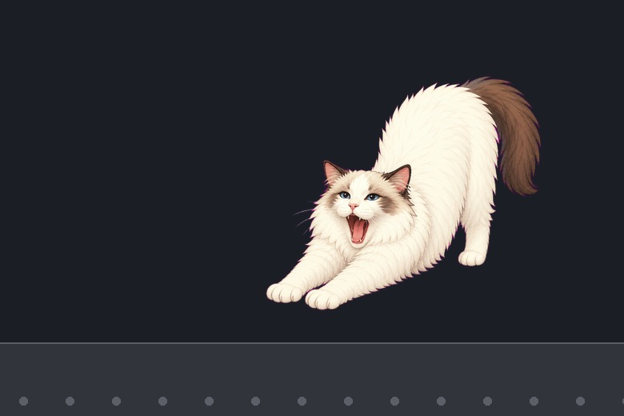
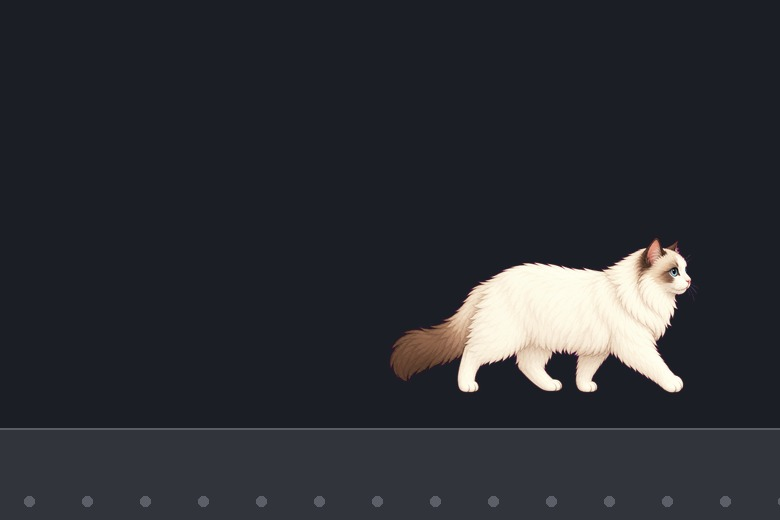
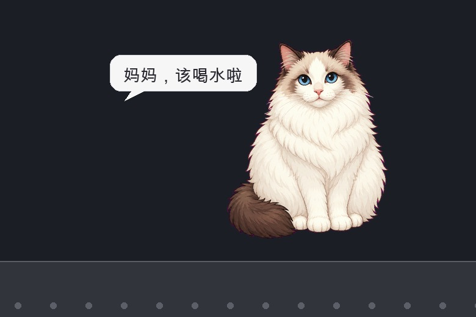

# BoziDockCat

[中文](README.md) | English

BoziDockCat is a customized macOS desktop companion cat based on [Auwuua/DockCat](https://github.com/Auwuua/DockCat). The star is **Bozi** (波子), our Ragdoll cat.

<table>
  <tr>
    <td align="center"></td>
    <td align="center"></td>
    <td align="center"></td>
  </tr>
</table>

## Quick Start

Download `BoziDockCat.zip` from [Releases](https://github.com/genzuuuu/BoziDockCat/releases), or run:

```bash
git clone https://github.com/genzuuuu/BoziDockCat.git
cd BoziDockCat
./scripts/install_local.sh
```

## Build / Package

```bash
./scripts/package_bozi_release.sh
```

If Xcode is not installed, the script patches the official DockCat release with Bozi assets.

## Credits & License

Based on [DockCat](https://github.com/Auwuua/DockCat) under the PolyForm Noncommercial License. See [LICENSE.txt](LICENSE.txt).
