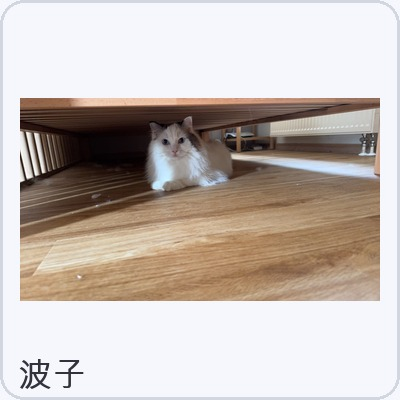

# BoziDockCat（波子 DockCat）

中文 | [English](README.en.md)

波子 DockCat 是基于 [Auwuua/DockCat](https://github.com/Auwuua/DockCat) 定制的 macOS 桌面陪伴小猫——主角是我们家的布偶猫 **波子**。

它会在程序坞边休息、伸懒腰、走来走去，也会温柔地提醒你喝水、起身走走。默认内置波子的自定义形象资源包，开箱即用。

<table>
  <tr>
    <td align="center"></td>
    <td align="center"></td>
    <td align="center"></td>
  </tr>
  <tr>
    <td align="center">伸懒腰</td>
    <td align="center">散步</td>
    <td align="center">喝水提醒</td>
  </tr>
</table>

## 关于波子

波子是一只布偶猫：雪白长毛、灰褐重点色耳朵和面部、明亮蓝眼睛、蓬松大尾巴。

<p align="center">
  
</p>

参考照片存放在 [`bozi/references/`](bozi/references/)。

## 快速使用

### 下载运行（推荐）

前往 [Releases](https://github.com/genzuuuu/BoziDockCat/releases) 下载 `BoziDockCat.zip`，解压后将 `DockCat.app` 拖入「应用程序」文件夹。

首次启动建议右键「打开」以绕过 Gatekeeper。

### 本地一键安装

```bash
git clone https://github.com/genzuuuu/BoziDockCat.git
cd BoziDockCat
./scripts/install_local.sh
```

脚本会打包 `BoziDockCat.zip`、安装到 `~/Applications/BoziDockCat.app` 并尝试启动。

### 从源码构建（需要完整 Xcode）

```bash
git clone https://github.com/genzuuuu/BoziDockCat.git
cd BoziDockCat
./scripts/package_bozi_release.sh
open BoziDockCat.zip
```

若未安装 Xcode，打包脚本会自动用波子资源包 patch 官方 DockCat 发布版。

## 自定义波子形象

当前仓库已包含初版波子精灵图（AI 生成 + 自动抠图）。若要迭代优化：

1. 阅读 [`CustomizationGuide/波子图片生成提示词.md`](CustomizationGuide/波子图片生成提示词.md)
2. 使用 `bozi/references/` 中的照片作为 AI 参考图
3. 运行 `python3 scripts/process_bozi_assets.py` 处理新素材
4. 重新运行 `./scripts/package_bozi_release.sh` 并安装

资源包目录：[`CatPacks/bozi/`](CatPacks/bozi/)

更通用的自定义说明见 [CustomizationGuide/自定义指引.md](CustomizationGuide/自定义指引.md)。

## 项目结构

```text
BoziDockCat/
  DockCatApp/          # macOS 应用源码
  CatPacks/bozi/       # 波子资源包（可独立分享）
  bozi/references/     # 波子真实照片参考
  scripts/             # 打包、安装、素材处理脚本
  CustomizationGuide/  # 定制与提示词文档
```

## 致谢与许可

本项目基于 [DockCat](https://github.com/Auwuua/DockCat)（PolyForm Noncommercial License）。完整条款见 [LICENSE.txt](LICENSE.txt)。

- 原作者：Auwuua
- 波子定制：genzuuuu
